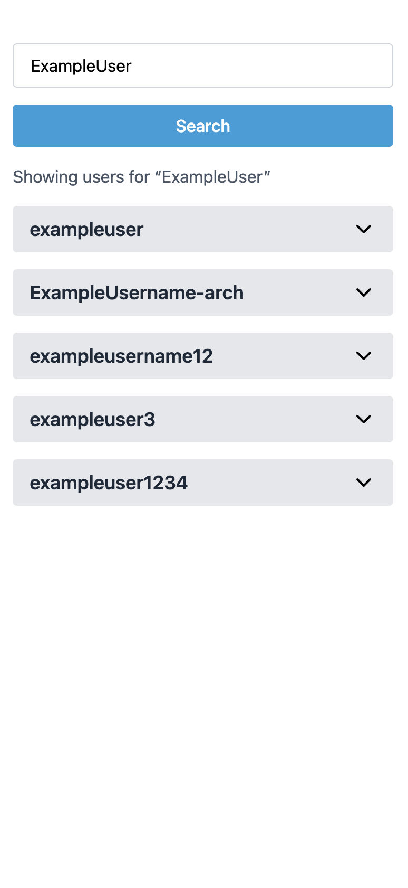
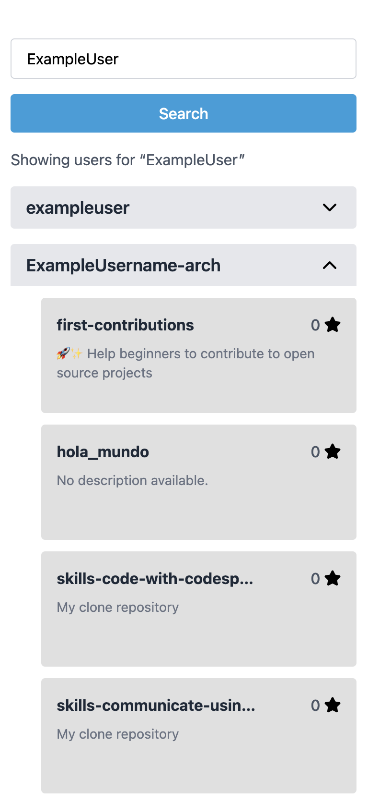

# GitHub Repo Explorer

**GitHub Repo Explorer** is a modern web application built with React and TypeScript that allows you to search for GitHub users and explore their public repositories. Enter a username to quickly find up to 5 matching GitHub users, then click on a user to view all their repositories, including star counts and descriptions. The app features a clean, responsive UI, robust error handling, and comprehensive test coverage.

## Live Demo

[https://lazuardidev.github.io/github-repo-explorer/](https://lazuardidev.github.io/github-repo-explorer/)

## Screenshots

|        Home (Search)         |          User Results           |       User Repositories       |
| :--------------------------: | :-----------------------------: | :---------------------------: |
|  |  |  |

## Features

- Search for GitHub users by username (up to 5 results)
- View repositories for a selected user (no limit)
- Responsive, clean UI with Tailwind CSS
- Error, loading, and empty states
- Unit tests (Vitest, React Testing Library)
- E2E tests (Cypress)

## Tech Stack

- React 19 + TypeScript
- Vite
- Tailwind CSS
- React Query
- React Router
- Lucide React Icons
- Vitest & React Testing Library (unit/integration tests)
- Cypress (E2E tests)

## Getting Started

### 1. Clone the repository and navigate to the project directory

```sh
git clone https://github.com/lazuardidev/github-repo-explorer.git
cd github-repo-explorer
```

### 2. Install dependencies

```sh
npm install
```

### 3. Create a .env file

After installing dependencies, create a `.env` file in the project root with the following content:

```env
VITE_BASE_URL=https://api.github.com
```

### 4. Start the development server

```sh
npm run dev
```

Visit [http://localhost:5173](http://localhost:5173) in your browser.

### 5. Run unit tests

```sh
npm run test
or
npm run test:coverage
```

### 6. Run E2E tests (Cypress)

```sh
npm run cypress:open
or
npm run cypress:run
```

## Project Structure

```
📁 src/
├── 📁 assets/
├── 📁 components/
│   ├── 📁 pages/
│   │   ├── 📁 home-page/
│   │   └── 📁 error-page/
│   └── 📁 ui/
│       ├── 📁 SearchForm/
│       ├── 📁 UserList/
│       └── 📁 RepoList/
├── 📁 config/
├── 📁 interfaces/
├── 📁 routes/
├── 📁 services/
└── ...
📁 cypress/
├── 📁 e2e/
├── 📁 fixtures/
```

## API

- Uses the public [GitHub REST API](https://docs.github.com/en/rest)
- No authentication required for basic usage (rate-limited)

## Contributing

Contributions are welcome! Please feel free to submit a Pull Request.
